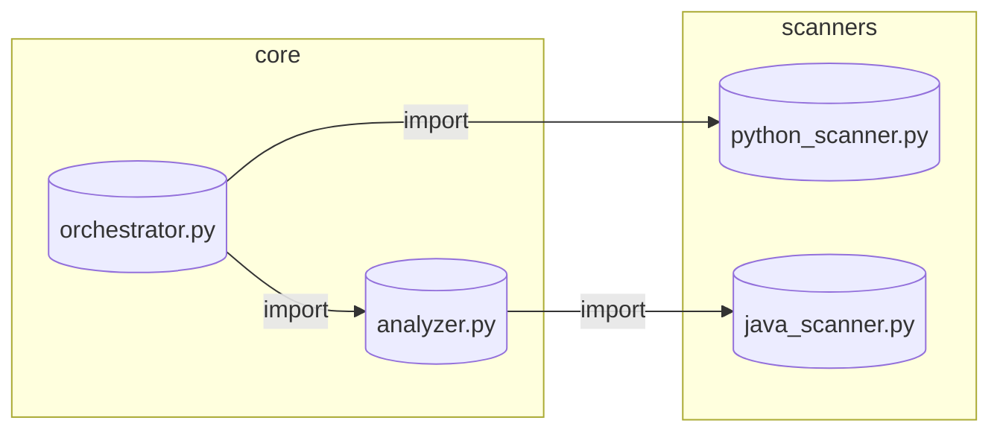

# DepPulse 扩展实现计划

> **目标版本**: 0.2.0
> **日期**: 2026-05-21
> **范围**: 5 个新功能 + 1 个用户体验改进

---

## 概览

本计划为 DepPulse 添加以下能力：

| # | 功能 | 模块 | 复杂度 |
|---|------|------|--------|
| 1 | Java/Kotlin 扫描器 | `scanners/` | 高 |
| 2 | 深度符号级调用图分析 | `core/callgraph.py` (新) | 高 |
| 3 | CI 集成（GitHub Actions + pre-commit hook） | `.github/`, `.pre-commit-config.yaml` | 中 |
| 4 | SARIF 格式输出 | `reporting/sarif.py` (新) | 低 |
| 5 | 增量 diff 模式 | `core/orchestrator.py` (改造) | 中 |
| 6 | 可视化输出 | `ui/visualize.py` (新) | 中 |

---

## 阶段 0：技术调研（文档发现）

**目标**: 确认关键技术细节，避免虚构 API。

### 任务 0.1：Java/Kotlin 解析技术选型

需要调研：

- **选项 A**: `javalang`（纯 Python Java 解析器，MIT 许可证）— 适合无 JVM 环境
- **选项 B**: `python-igraph` + `GraalVM` 子进程 — 过度工程化
- **选项 C**: 正则表达式扫描（类似 C++ 扫描器）— 快速但有限

**推荐**: 选项 A（`javalang`）+ 正则混合方案，因为：
- `javalang` 支持 Java 1.5+ 的 import/declaration 语法
- Kotlin 可复用 Java 语法（import、package）
- 符号级分析（方法调用）需要类型解析，复杂度高，放到阶段 3
- 正则补充处理 javalang 覆盖不到的语法边界

### 任务 0.2：SARIF 格式规范

- 阅读 [SARIF 2.1.0 规范](https://docs.oasis-open.org/sarif/sarif/v2.1.0/sarif-v2.1.0.html) 关键章节
- 确认必需字段：`version`, `runs[].results[]`, `runs[].tool.driver`
- SARIF 的 `results[].ruleId` 对应 DepPulse 的 `DependencyKind`
- SARIF `location` 使用 URI + 行号

### 任务 0.3：增量 diff 现有基础设施

- 确认 `cache.py` 的缓存格式和 mtime 机制
- 确认 `git.py` 的 `get_changed_files()` 接口
- 确认 `orchestrator.py` 中哪些方法需要改造以支持增量

### 任务 0.4：可视化技术选型

- **选项 A**: Mermaid.js（ASCII-art 流程图，适合嵌入 Markdown/HTML）
- **选项 B**: Graphviz DOT 格式（高质量图像，可用 `dot` 命令生成 PNG/SVG）
- **选项 C**: D3.js 力导向图（交互式 HTML 页面）
- **选项 D**: 输出到 `.deppulse/graph.json` + 配套 HTML 查看器

**推荐**: 选项 D（JSON）+ Mermaid（文本）双轨输出。用户可以通过 `deppulse viz --format mermaid` 生成文本图，或 `deppulse viz --format html` 生成交互页面。

---

## 阶段 1：Java/Kotlin 扫描器

**依赖**: 阶段 0 任务 0.1 完成

### 任务 1.1：依赖和配置

- 在 `requirements.txt` 添加 `javalang>=0.13.0`
- 或创建 `requirements-optional.txt` 包含可选依赖

### 任务 1.2：`scanners/java_scanner.py`

```python
class JavaScanner(BaseScanner):
    # .java 文件扫描器
    # 职责：
    # 1. can_scan(path) -> 检查 .java 后缀
    # 2. scan(file_path, project_root, file_index) -> ScanResult
    # 3. resolve_dependency(...) -> ResolvedDependency（继承默认行为或覆盖）
```

**扫描逻辑**：

1. **Package 声明解析**: `^\s*package\s+([\w.]+)\s*;` → 记录包路径
2. **Import 解析**（用 javalang AST）:
   - `import pkg.Class` → 绝对导入
   - `import pkg.Sub.*` → 通配符导入（记录为 dependency 但标记 wildcard）
   - `import static pkg.Class.member` → 静态导入
3. **符号解析**（用 javalang AST）:
   - `CompilationUnit.types` → `TypeDeclaration`（类/接口）
   - `TypeDeclaration.methods` → 方法名
   - `TypeDeclaration.fields` → 字段名
   - 记录 fully qualified name: `pkg.OuterClass.InnerClass.methodName`
4. **类型解析策略**（简化版，不做完整类型推断）:
   - 本文件内定义的类 → 内部依赖
   - 同包下的类 → 内部依赖（`file_index` 查找同 package 的其他 .java）
   - `java.lang.*` → stdlib
   - `javax.*` → stdlib
   - `kotlin.*` → stdlib
   - `org.springframework.*`, `com.google.*`, `android.*` → external
   - 其他 → external 或 unresolved

### 任务 1.3：`scanners/kotlin_scanner.py`

**复用 Java 扫描器核心逻辑**，不同之处：

1. `can_scan(path)` → 检查 `.kt` / `.kts` 后缀
2. Package 语法相同
3. Import 语法相同（Kotlin import 语法是 Java 的超集）
4. 符号类型映射：
   - `fun` → function symbol
   - `class` / `object` / `interface` → class symbol
   - `val` / `var` → property symbol
5. **Kotlin 特有处理**:
   - `import pkg.*` → 通配符（与 Java 相同）
   - `typealias` → 记录为 symbol
   - `.kt` 文件不一定有 package 声明（默认包）
   - `.kts` 脚本文件（可选支持，标记为 `is_script=True`）

### 任务 1.4：扫描器注册

在 `core/orchestrator.py` 的 `_SCANNER_REGISTRY` 添加：

```python
_SCANNER_REGISTRY: list[BaseScanner] = [
    PythonScanner(),
    CppScanner(),
    JavaScanner(),     # 新
    KotlinScanner(),    # 新
]
```

### 任务 1.5：模型扩展

在 `models.py` 中：

```python
class Language(Enum):
    PYTHON = "python"
    CPP = "cpp"
    JAVA = "java"       # 新
    KOTLIN = "kotlin"   # 新
    UNKNOWN = "unknown"

class DependencyKind(Enum):
    # ... 现有 ...
    JAVA_IMPORT = "java_import"      # 新
    KOTLIN_IMPORT = "kotlin_import"  # 新
```

### 任务 1.6：测试

- 创建 `tests/test_java_scanner.py` — 测试 import 解析、package 解析、符号解析
- 创建 `tests/test_kotlin_scanner.py` — 测试 Kotlin 特有语法
- 用真实开源 Java/Kotlin 项目（如 [guava](https://github.com/google/guava), [okhttp](https://github.com/square/okhttp)）做集成测试

### 验证清单

- [ ] `deppulse scan --help` 显示 Java/Kotlin 文件被扫描
- [ ] `deppulse report --json` 包含 `language: "java"` / `"kotlin"` 的节点
- [ ] `tests/test_java_scanner.py` 全部通过
- [ ] `tests/test_kotlin_scanner.py` 全部通过
- [ ] Java stdlib (`java.util.List`) 正确标记为 `is_stdlib=True`

---

## 阶段 2：深度符号级调用图分析

**依赖**: 阶段 1 完成（扫描器为 call graph 提供数据）

### 任务 2.1：新建 `core/callgraph.py`

新增 `CallGraphBuilder` 类，构建符号级依赖图：

```python
class CallGraphBuilder:
    """
    在文件级依赖图之上，构建符号级（方法/函数）调用图。
    每个节点是 (file_path, symbol_name) 元组。
    每条边是符号间的调用关系。
    """
    def __init__(self, scan_results: list[ScanResult], file_index: dict[str, Path]):
        self.scan_results = scan_results
        self.file_index = file_index

    def build(self) -> CallGraphResult:
        """返回符号级依赖图和分析结果"""
```

**符号级依赖解析策略**：

1. **Python**: 从 `ScanResult.symbols`（已由 PythonScanner 填充）获取所有函数/类/方法
   - 调用关系解析：扫描函数体 AST，查找 `Name` / `Attribute` 节点
   - 使用简单的最近定义作用域规则（不做完整类型推断）
   - 记录 `calls: list[tuple[Symbol, Symbol]]` — (caller, callee) 对

2. **Java/Kotlin**: 类似策略，从 JavaScanner/KotlinScanner 的符号数据出发
   - 解析方法调用表达式（`MethodInvocation` 在 javalang AST 中）
   - 解析构造函数调用（`ClassCreator` 节点）
   - 字段访问（`VariableDeclarator` / `FieldAccess`）

3. **C++**: 符号信息有限，仅基于 include 关系构建近似调用图
   - `#include "foo.h"` → 假设 foo.h 中的所有已声明函数可能被调用
   - 标记为 `approximate=True` 以区分精度

### 任务 2.2：扩展 `models.py` 添加符号级模型

```python
@dataclass
class Symbol:
    file_path: str                    # project-relative POSIX path
    name: str                         # simple name (e.g. "processData")
    fully_qualified: str               # e.g. "com.example.Utils.processData"
    symbol_type: SymbolType           # FUNCTION, CLASS, METHOD, PROPERTY
    language: Language
    line_number: int
    signature: str | None             # e.g. "(str, int) -> bool"

class SymbolType(Enum):
    FUNCTION = "function"
    CLASS = "class"
    METHOD = "method"
    PROPERTY = "property"
    CONSTRUCTOR = "constructor"
    UNKNOWN = "unknown"

@dataclass
class SymbolCall:
    caller: Symbol
    callee: Symbol
    call_site: tuple[str, int]       # (file_path, line_number)
    is_polymorphic: bool             # 虚函数调用（Java/C++）
    is_external: bool                # 跨模块/外部库调用

@dataclass
class CallGraphResult:
    nodes: list[Symbol]
    edges: list[SymbolCall]
    stats: CallGraphStats

@dataclass
class CallGraphStats:
    total_symbols: int
    total_calls: int
    external_calls: int
    polymorphic_calls: int
    max_call_depth: int              # 最大调用链深度
```

### 任务 2.3：暴露 CLI 命令

```bash
deppulse callgraph [--file PATH] [--format json|mermaid|dot] [--output FILE]
```

- `--file`: 只分析指定文件内的符号（默认全项目）
- `--format`: 输出格式
  - `json`: 机器可读的调用图数据
  - `mermaid`: Mermaid.js flowchart 代码
  - `dot`: Graphviz DOT 格式
- `--output`: 输出到文件（默认 stdout）

### 任务 2.4：集成到报告

- 在 `AuditReport` 中添加可选字段 `call_graph: CallGraphResult | None`
- `deppulse report --full` 时包含符号级调用图

### 验证清单

- [ ] `deppulse callgraph --format mermaid` 输出有效的 Mermaid 流程图
- [ ] 调用链深度分析正确（`max_call_depth`）
- [ ] 外部调用正确标记 `is_external=True`
- [ ] Java 多态调用正确标记 `is_polymorphic=True`

---

## 阶段 3：CI 集成

**依赖**: 无（独立功能）

### 任务 3.1：GitHub Actions Workflow

创建 `.github/workflows/deppulse-ci.yml`:

```yaml
name: DepPulse Dependency Analysis

on:
  push:
    branches: [main, develop]
  pull_request:
    branches: [main]

jobs:
  deppulse:
    runs-on: ubuntu-latest
    steps:
      - uses: actions/checkout@v4
      - name: Set up Python
        uses: actions/setup-python@v5
        with:
          python-version: '3.11'
      - name: Install DepPulse
        run: pip install deppulse
      - name: Run DepPulse scan
        run: deppulse scan --json-output deppulse-report.json
      - name: Check for high-risk dependencies
        run: |
          python -c "
            import json
            with open('deppulse-report.json') as f:
              data = json.load(f)
            # fail if any HIGH risk level
            high_risk = [n for n in data.get('nodes', [])
                         if n.get('risk_level') == 'HIGH']
            if high_risk:
              print(f'High-risk files: {high_risk}')
              exit(1)
          "
      - name: Upload SARIF
        uses: actions/upload-artifact@v4
        with:
          name: deppulse-sarif
          path: deppulse-report.sarif
```

**增强版**（可选）：

- `deppulse scan --changed-only` 仅扫描 PR 变更文件
- 生成 SARIF 文件并上传
- 在 PR 评论中发布摘要

### 任务 3.2：Pre-commit Hook

创建 `.pre-commit-hooks.yaml`（配合 pre-commit 框架）:

```yaml
# .pre-commit-hooks.yaml（DepPulse 仓库根目录，供其他项目引用）
- id: deppulse-scan
  name: DepPulse dependency scan
  description: Scan for risky dependency changes
  entry: deppulse scan --json-output .deppulse/scan.json
  language: system
  files: '\.(py|java|kt|cpp|h|hpp)$'
  pass_filenames: false  # 全量扫描，不传文件名
  stages: [pre-commit, push]
```

创建 `.pre-commit-config.yaml`（DepPulse 项目自身使用）:

```yaml
repos:
  - repo: https://github.com/your-user/deppulse
    rev: v0.2.0
    hooks:
      - id: deppulse-scan
        args: ['--threshold', 'HIGH']
```

### 任务 3.3：CI 输出美化

在 `cli.py` 中添加 `--ci` 模式：

- 安静模式，减少非关键输出
- 错误级别输出专用于 CI 日志解析
- 格式：`##[group]DepPulse##[endgroup]`（GitHub Actions 格式）

### 验证清单

- [ ] `.github/workflows/deppulse-ci.yml` 语法正确（YAML 格式验证）
- [ ] `.pre-commit-hooks.yaml` 符合 pre-commit schema
- [ ] `deppulse scan --ci` 在 CI 环境下输出正确格式

---

## 阶段 4：SARIF 格式输出

**依赖**: 无（可在任意阶段实现）

### 任务 4.1：新建 `reporting/sarif.py`

```python
def graph_to_sarif(result: GraphBuildResult, *, tool_name: str = "DepPulse", tool_version: str = __version__) -> dict:
    """
    将 GraphBuildResult 转换为 SARIF 2.1.0 格式。
    """
```

**SARIF 结构映射**：

```
sarifLog
└── runs[0]
    ├── tool.driver (name="DepPulse", version, informationUri)
    ├── results[]
    │   ├── ruleId        → DependencyKind.value (e.g. "java_import")
    │   ├── level         → "warning" (external/unresolved) 或 "note" (internal)
    │   ├── message.text  → 描述性文本
    │   ├── locations[0]
    │   │   └── physicalLocation.artifactLocation.uri + startLine
    │   └── relatedLocations[] → 目标依赖的位置
    └── files{}  (optional file contents index)
```

### 任务 4.2：SARIF 结果映射策略

| DepPulse 概念 | SARIF mapping |
|---|---|
| `ResolvedDependency` (internal) | SARIF `result.level = "note"` |
| `ResolvedDependency` (external) | SARIF `result.level = "warning"` |
| `ResolvedDependency` (unresolved) | SARIF `result.level = "error"` |
| `DependencyKind` | SARIF `ruleId` |
| `EdgeMetadata` | SARIF `relatedLocations` |
| `RiskReport` | SARIF `results[].properties.risk_*` |

### 任务 4.3：CLI 集成

```bash
deppulse scan --sarif-output deppulse.sarif
deppulse report --format sarif --output deppulse.sarif
```

在 `cli.py` 中：

```python
parser.add_argument('--sarif-output', type=Path, help='Write SARIF report to file')
```

### 验证清单

- [ ] `--sarif-output` 生成的文件通过 [SARIF validator](https://sarifstudio.azurewebsites.net/validate) 验证
- [ ] SARIF 文件包含 `version: "2.1.0"`
- [ ] GitHub SARIF upload 能正确解析结果（上传到 `.github/workflows` 的 SARIF）

---

## 阶段 5：增量 Diff 模式

**依赖**: 阶段 1（扫描器）+ 阶段 4（输出格式）

### 任务 5.1：改造 `orchestrator.py` 缓存机制

在 `ScanCache` 中添加增量模式支持：

```python
class ScanCache:
    # 新增方法
    def get_changed_files(self, current_files: set[str]) -> tuple[set[str], set[str]]:
        """
        返回 (removed_files, stale_files)
        removed_files: 在缓存中存在但当前不存在
        stale_files: 在缓存中存在且 mtime/size 已变化
        """
        # 缓存中有，当前没有 → removed
        # 缓存中有，当前有，但 mtime/size 不同 → stale
```

### 任务 5.2：新增 `--changed-only` / `--incremental` 标志

```bash
deppulse scan --incremental
deppulse diff --incremental  # 基于 git diff + 增量扫描
```

**增量扫描逻辑**（新方法 `_scan_incremental`）：

```
1. 获取 git changed_files（已有 git.py 支持）
2. 获取 changed_files 的直接上游依赖者（predecessors）
3. 对 (changed_files ∪ upstream_dependents) 进行重新扫描
4. 从缓存加载未变化的文件
5. 合并结果，构建图
6. 对 removed_files，从图中删除节点
```

### 任务 5.3：`--since` 参数

```bash
deppulse scan --since "1 week ago"
deppulse scan --since HEAD~5
deppulse scan --since 2026-01-01
```

解析各种时间格式，调用 `git log --since` 获取变更文件列表。

### 任务 5.4：增量报告

```bash
deppulse diff --markdown-output incremental-report.md
```

生成 Markdown 报告，包含：
- **新增依赖**: 本次新增的边
- **移除依赖**: 上次存在但本次消失的边
- **变更文件**: 实际被修改的文件列表
- **影响分析**: 变更文件的 blast radius

### 验证清单

- [ ] `--incremental` 模式下，扫描时间显著减少（对比全量扫描）
- [ ] `deppulse diff --incremental --json` 输出包含 `changed_files`, `removed_edges`, `added_edges`
- [ ] 缓存中的 stale 文件被正确重新扫描
- [ ] 已删除文件的缓存条目被清理

---

## 阶段 6：可视化输出

**依赖**: 阶段 1（扫描器提供数据）+ 阶段 2（call graph 提供符号数据）

### 任务 6.1：新建 `ui/visualize.py`

```python
def render_mermaid_graph(graph: nx.DiGraph, *, title: str = "Dependency Graph") -> str:
    """生成 Mermaid flowchart 代码"""

def render_dot_graph(graph: nx.DiGraph, *, title: str = "Dependency Graph") -> str:
    """生成 Graphviz DOT 格式"""

def render_html_dashboard(
    result: GraphBuildResult,
    callgraph: CallGraphResult | None,
    *,
    output_path: Path
) -> None:
    """生成独立的 HTML 可视化页面"""
```

### 任务 6.2：Mermaid 输出

```
deppulse viz --format mermaid
deppulse report --mermaid-output graph.mmd
```

输出示例（Mermaid 格式）:



- 按语言分组（subgraph）
- 边标签显示依赖类型（`import`, `include`, `java_import`）
- 高风险节点用红色标记
- 无外部依赖的单文件用灰色标记

### 任务 6.3：HTML Dashboard

生成包含以下内容的独立 HTML 文件：

1. **依赖网络图** — D3.js 力导向图
   - 按语言着色（Python=蓝, Java=橙, Kotlin=紫, C++=绿）
   - 节点大小按入度（被依赖越多越大）
   - 红色节点表示高风险
   - 支持拖拽、缩放、点击查看节点详情
2. **文件统计** — 饼图/柱状图（按语言）
3. **依赖热度图** — 文件间依赖密度热力图
4. **调用链浏览器** — 从指定文件出发的调用树

技术实现：
- 单文件 HTML，所有 JS/CSS 内联（通过 `embed=True` 模式嵌入资源）
- 或生成 `graph.json` + 轻量 HTML 模板，用户用浏览器打开

### 任务 6.4：CLI 集成

```bash
deppulse viz [--format html|mermaid|dot]
deppulse viz --output deppulse-dashboard.html
deppulse viz --focus PATH   # 只显示 PATH 及其直接依赖
deppulse viz --depth 2     # 显示 2 度邻居
deppulse viz --risk-level HIGH  # 只显示 HIGH 风险节点
```

### 任务 6.5：集成到 `report` 命令

`deppulse report --full` 自动生成 `deppulse-dashboard.html` 并附带在报告目录下。

### 验证清单

- [ ] `deppulse viz --format mermaid` 输出有效的 Mermaid 代码
- [ ] `deppulse viz --output dashboard.html` 生成可用的 HTML 文件
- [ ] HTML dashboard 在浏览器中正常显示力导向图
- [ ] `--focus` 和 `--depth` 正确过滤视图
- [ ] 高风险节点用红色标记

---

## 实施顺序建议

```
阶段 1 (Java/Kotlin) ──┐
                        ├──→ 阶段 2 (Call Graph) ──→ 阶段 6 (Viz)
阶段 4 (SARIF)  ────────┤
                        │
阶段 3 (CI)  ───────────┤
                        │
阶段 5 (Incremental) ───┘
```

**推荐顺序**：

1. **阶段 4（SARIF）** → 最快完成（无依赖），可立即产出价值
2. **阶段 1（Java/Kotlin）** → 核心扫描能力扩展
3. **阶段 2（Call Graph）** → 深度分析能力
4. **阶段 3（CI）** → 工程化落地
5. **阶段 5（Incremental）** → 性能优化
6. **阶段 6（Viz）** → 用户体验（可与阶段 2 并行）

---

## 文件变更汇总

| 操作 | 文件路径 |
|------|---------|
| 修改 | `requirements.txt` |
| 修改 | `deppulse/models.py` |
| 修改 | `deppulse/core/orchestrator.py` |
| 修改 | `deppulse/core/analyzer.py` |
| 修改 | `deppulse/cli.py` |
| 修改 | `deppulse/reporting.py` |
| 修改 | `deppulse/cache.py` |
| 修改 | `deppulse/git.py` |
| 新建 | `deppulse/scanners/java_scanner.py` |
| 新建 | `deppulse/scanners/kotlin_scanner.py` |
| 新建 | `deppulse/core/callgraph.py` |
| 新建 | `deppulse/reporting/sarif.py` |
| 新建 | `deppulse/ui/visualize.py` |
| 新建 | `.github/workflows/deppulse-ci.yml` |
| 新建 | `.pre-commit-hooks.yaml` |
| 新建 | `.pre-commit-config.yaml` |
| 新建 | `tests/test_java_scanner.py` |
| 新建 | `tests/test_kotlin_scanner.py` |
| 新建 | `tests/test_sarif.py` |
| 新建 | `tests/test_incremental.py` |
| 新建 | `tests/test_callgraph.py` |

---

## 风险与依赖

| 风险 | 缓解策略 |
|------|---------|
| javalang 不支持最新 Java 特性 | 降级为正则回退；对不支持的语法记录 `is_approximate=True` |
| 符号级调用图精度不足 | 提供 `--approximate` 模式，明确告知用户精度限制 |
| HTML 可视化体积过大 | 提供 `--lightweight` 选项，禁用力导向动画，仅生成静态图 |
| 增量模式在大型项目中内存占用 | 使用生成器模式逐步构建图，不一次性加载所有结果 |
| SARIF 与旧版本不兼容 | 固定输出 SARIF 2.1.0，说明最低支持版本 |
